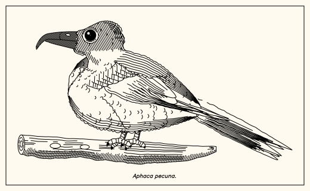
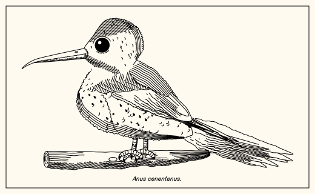
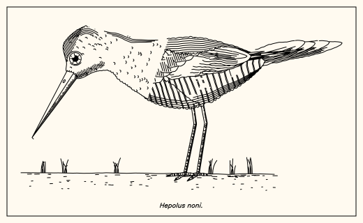
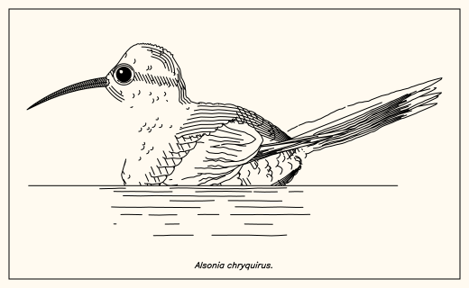
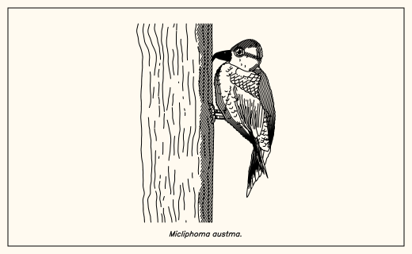
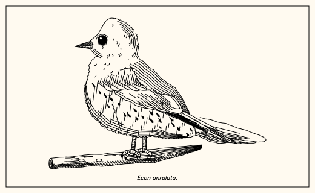
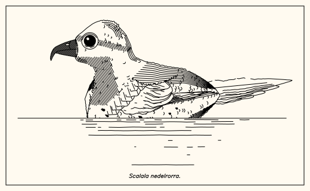
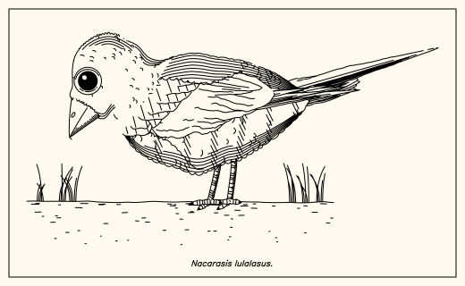
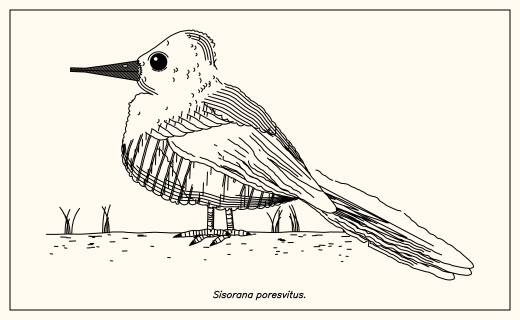
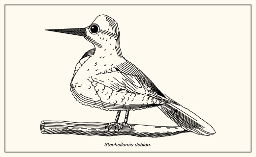

# birddraw

*procedurally generated bird drawings. [demo](https://niklasprobul.github.io/birddraw/). a sister of [fishdraw](https://github.com/LingDong-/fishdraw) by Lingdong Huang.*



- generates all sorts of weird birds
- outputs polylines (supported format svg, json, csv, etc.)
- full procedural generation, single file no dependencies
- plotter-centric
- export drawing animation:


## usage

basic

```
node birddraw.js > output.svg
```

specify seed (from a string), speed of drawing and output format:

```
node birddraw.js --seed "Avis magnifica" --format smil --speed 2 > output.svg
```

- the seed string is used as the name of the bird (printed in the drawing). If unspecified, a random pseudo-Latin name will be auto generated.
- the speed number is used to control the speed of drawing animation. Larger the number is, faster it draws. This option works only with format `smil`.
- format options: `svg` (regular svg), `smil` (animated svg), `csv` (each polyline on a comma-separated line), `json` and `ps`.

in the browser: `index.html` draws a new bird on every visit, seeded by the time of the visit.
`index.html?seed=Avis%20magnifica` draws a fixed bird. it works on any static host, such as
GitHub Pages, with no build step.

use as JS library:

```js
const {bird,generate_params} = require('./birddraw.js');
let polylines = bird(generate_params());
console.log(polylines);
```


## gallery










